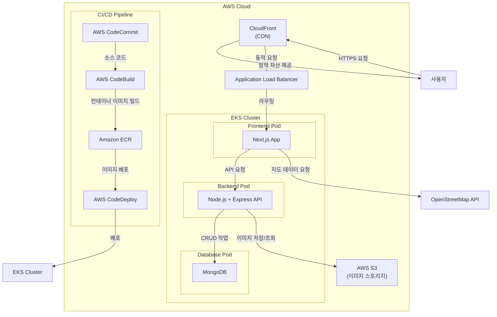
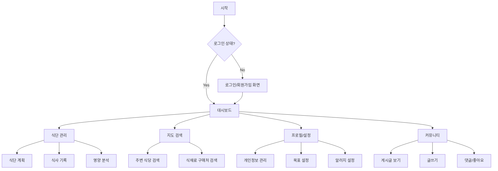
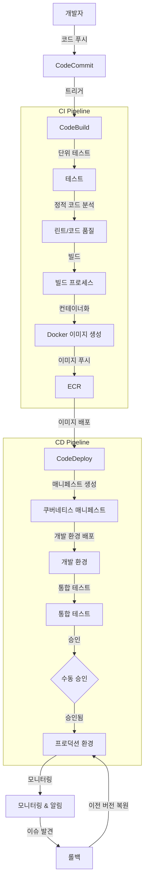

# 다이어트 관리 앱 설계서

## 목차
1. 프로젝트 개요
2. 기술 스택 선정 이유
3. 시스템 아키텍처
4. 기능 명세
5. UI/UX 설계
6. 데이터베이스 설계
7. 인프라 구성
8. CI/CD 파이프라인
9. 보안 전략
10. 프로젝트 로드맵

## 1. 프로젝트 개요

- 사용자가 식단을 계획하고 추적
- 지리적 위치 기반으로 식재료 구매 장소나 건강한 식사를 제공하는 식당을 찾을 수 있는 플랫폼
- 사용자 친화적인 인터페이스와 개인화된 식단 관리 시스템을 통해 건강한 생활 습관 형성

## 2. 기술 스택 선정 이유

### Frontend: Next.js + TypeScript
- **선정 이유**:
  - **서버 사이드 렌더링(SSR)**: SEO 최적화 및 초기 로딩 속도 향상
  - **정적 생성**: 성능 최적화와 CDN 활용으로 글로벌 사용자에게 빠른 접근성 제공
  - **TypeScript 통합**: 타입 안정성으로 개발 과정에서 버그 조기 발견 및 자동완성 지원
  - **컴포넌트 기반 구조**: 재사용 가능한 UI 컴포넌트로 일관된 사용자 경험 제공
  - **API 라우트**: 백엔드 API 엔드포인트 개발 간소화
  - **자동 코드 분할**: 페이지별 필요한 코드만 로드하여 초기 로딩 시간 단축

### Backend: Node.js + Express
- **선정 이유**:
  - **JavaScript 생태계 통일**: 프론트엔드와 동일 언어 사용으로 개발 효율성 증대
  - **비동기 이벤트 기반 아키텍처**: 동시 요청 처리에 최적화
  - **미들웨어 시스템**: 인증, 로깅, 에러 처리 등 모듈화된 기능 구현 용이
  - **확장성**: 마이크로서비스 구조로 확장 가능한 구조 제공
  - **활발한 생태계**: NPM의 방대한 라이브러리로 빠른 개발 가능

### Database: MongoDB
- **선정 이유**:
  - **스키마 유연성**: 사용자별 다양한 다이어트 데이터 형식 수용 가능
  - **수평적 확장성**: 샤딩을 통한 데이터 증가에 효과적 대응
  - **JSON 기반 문서**: JavaScript 객체와 유사한 형태로 데이터 처리 최적화
  - **지리공간 인덱싱**: 위치 기반 검색 기능 구현에 최적화된 기능 제공
  - **빠른 프로토타이핑**: 스키마 변경에 유연하게 대응 가능

### 지도 API: OpenStreetMap(OSM) + Leaflet.js
- **선정 이유**:
  - **오픈소스 무료 사용**: 상업적 사용에도 추가 비용 없음
  - **커스터마이징 자유도**: 다이어트 앱 특성에 맞는 지도 UI 구현 가능
  - **가벼운 라이브러리**: Leaflet.js의 경량 설계로 모바일 환경에서도 빠른 로딩
  - **풍부한 커뮤니티 지원**: 다양한 플러그인과 확장 기능 활용 가능
  - **개인정보 보호**: Google Maps 대비 사용자 데이터 추적 최소화

### 인프라: AWS EKS
- **선정 이유**:
  - **컨테이너 오케스트레이션**: Kubernetes를 통한 효율적인 리소스 관리
  - **확장성**: 트래픽 증가에 따른 자동 스케일링 지원
  - **서비스 격리**: 프론트엔드, 백엔드, DB를 독립적인 파드로 관리
  - **선언적 인프라**: Infrastructure as Code(IaC)를 통한 일관된 환경 구성
  - **고가용성**: 다중 AZ 배포를 통한 서비스 안정성 확보

## 3. 시스템 아키텍처



## 4. 기능 명세

### 사용자 관리
- 회원가입/로그인 (이메일, 소셜 로그인)
- 프로필 관리 (개인정보, 건강 목표, 알러지 정보 등)
- 신체 정보 관리 (키, 몸무게, BMI 등)

### 식단 관리
- 일일/주간/월간 식단 계획
- 레시피 검색 및 저장
- 영양소 계산 및 분석
- 알러지 재료 자동 필터링
- 식사 기록 및 사진 업로드

### 목표 관리
- 체중 목표 설정 및 추적
- 칼로리 섭취 목표 관리
- 영양소 균형 추적
- 진행 상황 시각화 (그래프, 차트)

### 지도 통합 기능
- 현재 위치 기반 건강식 레스토랑 검색
- 특정 식재료 판매 마트/시장 찾기
- 사용자 리뷰 및 평점 확인
- 경로 안내 및 거리 정보
- 즐겨찾기 장소 저장

### 커뮤니티 기능
- 다이어트 성공 사례 공유
- 건강 팁 및 레시피 공유
- 질문 및 답변 게시판
- 다이어트 챌린지 참여

## 5. UI/UX 설계

### 사용자 플로우



### 화면 설계

1. **홈 대시보드**
   - 오늘의 식단 요약
   - 목표 대비 진행 상황 (칼로리, 영양소 밸런스)
   - 추천 레시피 및 식당
   - 빠른 식사 기록 버튼

2. **식단 관리 화면**
   - 캘린더 뷰로 일/주/월 식단 계획
   - 드래그 앤 드롭으로 레시피 배치
   - 영양소 요약 차트
   - 식사별 상세 기록 (사진, 시간, 장소)

3. **지도 화면**
   - 사용자 위치 중심 지도 표시
   - 필터링 옵션 (음식 종류, 가격대, 영양소 중심)
   - 검색 결과 리스트와 지도 동시 표시
   - 즐겨찾기 및 최근 방문 장소 표시

4. **프로필 및 설정 화면**
   - 사용자 정보 및 건강 지표
   - 알러지 및 음식 선호도 설정
   - 목표 설정 및 수정
   - 앱 설정 (알림, 테마 등)

5. **커뮤니티 화면**
   - 카테고리별 게시글 모아보기
   - 인기 게시글 및 최신 글
   - 사용자 활동 내역
   - 검색 및 필터링 기능

## 6. 데이터베이스 설계

### MongoDB 컬렉션 구조

1. **Users**
   ```json
   {
     "_id": "ObjectId",
     "email": "string",
     "password": "string (해시)",
     "name": "string",
     "profileImage": "string (URL)",
     "healthInfo": {
       "height": "number",
       "weight": "number",
       "targetWeight": "number",
       "bmi": "number",
       "activityLevel": "string"
     },
     "dietaryPreferences": ["string"],
     "allergies": ["string"],
     "createdAt": "date",
     "updatedAt": "date"
   }
   ```

2. **Meals**
   ```json
   {
     "_id": "ObjectId",
     "userId": "ObjectId",
     "date": "date",
     "mealType": "string (breakfast/lunch/dinner/snack)",
     "name": "string",
     "foods": [
       {
         "name": "string",
         "quantity": "number",
         "unit": "string",
         "calories": "number",
         "nutrients": {
           "protein": "number",
           "carbs": "number",
           "fat": "number",
           "fiber": "number"
         }
       }
     ],
     "totalCalories": "number",
     "imageUrl": "string",
     "location": {
       "type": "Point",
       "coordinates": [longitude, latitude]
     },
     "restaurant": "string",
     "notes": "string",
     "createdAt": "date",
     "updatedAt": "date"
   }
   ```

3. **MealPlans**
   ```json
   {
     "_id": "ObjectId",
     "userId": "ObjectId",
     "startDate": "date",
     "endDate": "date",
     "dailyPlans": [
       {
         "date": "date",
         "meals": [
           {
             "mealType": "string",
             "plannedFoods": ["ObjectId (Foods)"],
             "completed": "boolean"
           }
         ],
         "targetCalories": "number",
         "notes": "string"
       }
     ],
     "createdAt": "date",
     "updatedAt": "date"
   }
   ```

4. **Foods**
   ```json
   {
     "_id": "ObjectId",
     "name": "string",
     "category": "string",
     "calories": "number",
     "servingSize": "number",
     "servingUnit": "string",
     "nutrients": {
       "protein": "number",
       "carbs": "number",
       "fat": "number",
       "fiber": "number",
       "sugar": "number",
       "sodium": "number",
       "vitamins": {
         "A": "number",
         "C": "number",
         "D": "number",
         // 기타 비타민
       },
       "minerals": {
         "calcium": "number",
         "iron": "number",
         // 기타 미네랄
       }
     },
     "allergens": ["string"],
     "imageUrl": "string",
     "createdBy": "ObjectId (관리자 생성 또는 사용자 추가)",
     "isVerified": "boolean",
     "createdAt": "date",
     "updatedAt": "date"
   }
   ```

5. **Places**
   ```json
   {
     "_id": "ObjectId",
     "name": "string",
     "type": "string (restaurant/market/etc)",
     "location": {
       "type": "Point",
       "coordinates": [longitude, latitude]
     },
     "address": "string",
     "contact": "string",
     "website": "string",
     "openingHours": [
       {
         "day": "string",
         "open": "string (HH:MM)",
         "close": "string (HH:MM)"
       }
     ],
     "tags": ["string"],
     "healthyOptions": "boolean",
     "priceRange": "number (1-5)",
     "averageRating": "number",
     "reviews": [
       {
         "userId": "ObjectId",
         "rating": "number",
         "comment": "string",
         "date": "date"
       }
     ],
     "createdAt": "date",
     "updatedAt": "date"
   }
   ```

6. **Community**
   ```json
   {
     "_id": "ObjectId",
     "userId": "ObjectId",
     "title": "string",
     "content": "string",
     "category": "string (success-story/recipe/question/tip)",
     "tags": ["string"],
     "images": ["string (URL)"],
     "likes": ["ObjectId (User)"],
     "comments": [
       {
         "userId": "ObjectId",
         "content": "string",
         "createdAt": "date"
       }
     ],
     "createdAt": "date",
     "updatedAt": "date"
   }
   ```

### 인덱스 설계
- Users: email (unique)
- Meals: userId + date (복합 인덱스)
- Places: location (2dsphere 인덱스)
- MealPlans: userId + startDate (복합 인덱스)
- Foods: name + category (복합 인덱스)
- Community: category + createdAt (복합 인덱스)

## 7. 인프라 구성

### AWS EKS 클러스터 구성

1. **노드 구성**
   - 프론트엔드: t3.medium (2vCPU, 4GB) - 2개 노드
   - 백엔드: t3.medium (2vCPU, 4GB) - 2개 노드
   - 데이터베이스: t3.large (2vCPU, 8GB) - 2개 노드

2. **쿠버네티스 리소스**
   - **프론트엔드 파드**
     - CPU: 요청 0.5, 제한 1
     - 메모리: 요청 1Gi, 제한 2Gi
     - 레플리카: 2-5 (HPA)
   - **백엔드 파드**
     - CPU: 요청 0.5, 제한 1
     - 메모리: 요청 1Gi, 제한 2Gi
     - 레플리카: 2-5 (HPA)
   - **MongoDB 파드**
     - CPU: 요청 1, 제한 2
     - 메모리: 요청 2Gi, 제한 4Gi
     - 레플리카: 3 (StatefulSet)
     - 영구 스토리지: AWS EBS 볼륨

3. **네트워크 구성**
   - VPC: CIDR 10.0.0.0/16
   - 퍼블릭 서브넷: 10.0.1.0/24, 10.0.2.0/24 (다중 AZ)
   - 프라이빗 서브넷: 10.0.3.0/24, 10.0.4.0/24 (다중 AZ)
   - NAT 게이트웨이: 퍼블릭 서브넷에 위치
   - 라우팅 테이블: 인터넷 접근 및 내부 통신 구성

4. **보안 구성**
   - 네트워크 정책 (NetworkPolicy)
   - 포드 보안 정책 (PodSecurityPolicy)
   - IAM 역할 기반 접근 제어 (RBAC)
   - AWS WAF 연동 (웹 응용 프로그램 방화벽)

5. **리소스 모니터링**
   - Prometheus + Grafana 대시보드
   - CloudWatch 로그 및 메트릭
   - X-Ray 트레이싱

### 스토리지 구성
- **S3 버킷**
  - 사용자 업로드 이미지 저장
  - 로그 아카이빙
  - 정적 리소스 호스팅
- **EBS 볼륨**
  - MongoDB 데이터 저장
  - 백업 및 스냅샷 자동화

## 8. CI/CD 파이프라인

### 워크플로우



### 환경별 배포 전략

1. **개발 환경**
   - 매 커밋마다 자동 배포
   - 테스트 데이터 자동 생성
   - 개발자 접근용 인그레스

2. **스테이징 환경**
   - 피처 브랜치 병합 후 자동 배포
   - 프로덕션과 유사한 구성
   - 통합 테스트 자동화

3. **프로덕션 환경**
   - 블루/그린 배포 전략
   - 카나리 릴리스 (트래픽 점진적 전환)
   - 롤백 자동화 구성

### 배포 자동화 구성

```yaml
# buildspec.yml 예시
version: 0.2

phases:
  pre_build:
    commands:
      - echo Logging in to Amazon ECR...
      - aws ecr get-login-password --region $AWS_DEFAULT_REGION | docker login --username AWS --password-stdin $AWS_ACCOUNT_ID.dkr.ecr.$AWS_DEFAULT_REGION.amazonaws.com
      - COMMIT_HASH=$(echo $CODEBUILD_RESOLVED_SOURCE_VERSION | cut -c 1-7)
      - IMAGE_TAG=${COMMIT_HASH:=latest}
  
  build:
    commands:
      - echo Build started on `date`
      - echo Building the Docker image...
      - docker build -t $REPOSITORY_URI:latest .
      - docker tag $REPOSITORY_URI:latest $REPOSITORY_URI:$IMAGE_TAG
  
  post_build:
    commands:
      - echo Build completed on `date`
      - echo Pushing the Docker image...
      - docker push $REPOSITORY_URI:latest
      - docker push $REPOSITORY_URI:$IMAGE_TAG
      - echo Writing image definitions file...
      - aws eks update-kubeconfig --name diet-app-cluster --region $AWS_DEFAULT_REGION
      - envsubst < kubernetes/deployment.yaml | kubectl apply -f -

artifacts:
  files:
    - kubernetes/deployment.yaml
    - appspec.yaml
    - taskdef.json
```

## 9. 보안 전략

### 인증 및 권한 관리
- JWT 기반 인증 시스템
- OAuth2.0 소셜 로그인 연동
- 역할 기반 접근 제어 (RBAC)
- API 키 로테이션 자동화

### 데이터 보안
- 저장 데이터 암호화 (AES-256)
- 전송 중 데이터 암호화 (TLS 1.3)
- 비밀번호 해싱 (bcrypt)
- MongoDB 인증 및 권한 설정

### 인프라 보안
- VPC 보안 그룹 및 네트워크 ACL
- 최소 권한 원칙 적용된 IAM 정책
- 보안 취약점 자동 스캔
- 비밀 관리 (AWS Secrets Manager)

### 컴플라이언스
- GDPR 준수 기능 (데이터 포터빌리티, 삭제 요청)
- 개인정보 처리방침 관리
- 건강 데이터 관련 규정 준수
- 감사 로깅 및 추적성

## 10. 프로젝트 로드맵

### 1단계: MVP 구축 (6주)
- 핵심 기능: 식단 기록, 기본 지도 연동, 사용자 관리
- 기본 인프라 구축: EKS 클러스터, CI/CD 파이프라인
- 초기 사용자 테스트 및 피드백 수집

### 2단계: 기능 확장 (8주)
- 고급 식단 계획 및 영양 분석
- 지도 기능 확장: 필터링, 리뷰, 평점
- 커뮤니티 기능 구현
- 성능 최적화 및 스케일링 테스트

### 3단계: 고도화 (10주)
- AI 기반 식단 추천 알고리즘
- 소셜 기능 및 챌린지 시스템
- 3rd 파티 연동 (피트니스 트래커, 건강 앱)
- 다국어 지원 및 국제화

### 4단계: 안정화 및 확장 (지속적)
- 사용자 피드백 기반 기능 개선
- 성능 모니터링 및 최적화
- 보안 강화 및 취약점 관리
- 신규 플랫폼 확장 (모바일 앱)

## 결론

본 다이어트 관리 앱은 Next.js, Node.js, MongoDB를 기반으로 사용자 친화적이면서도 기술적으로 견고한 시스템을 구축합니다. AWS EKS를 활용한 쿠버네티스 인프라는 확장성과 안정성을 보장하며, OpenStreetMap과 Leaflet.js를 통해 비용 효율적인 지도 서비스를 제공합니다. 체계적인 CI/CD 파이프라인을 통해 지속적인 개선과 안정적인 배포를 실현하며, 사용자의 다이어트 목표 달성을 위한 종합적인 솔루션을 제공합니다.